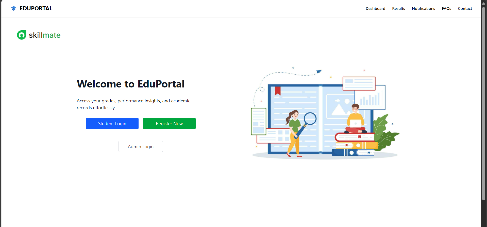
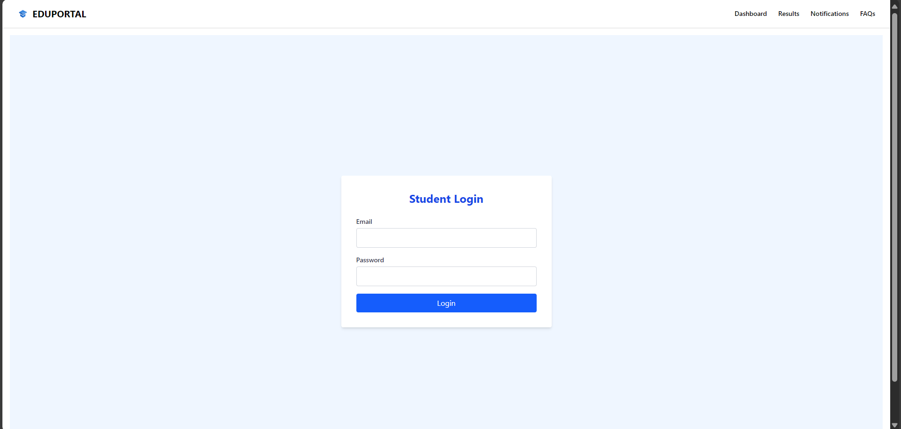
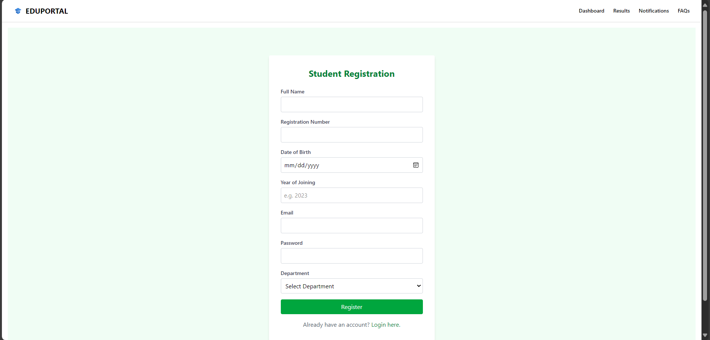
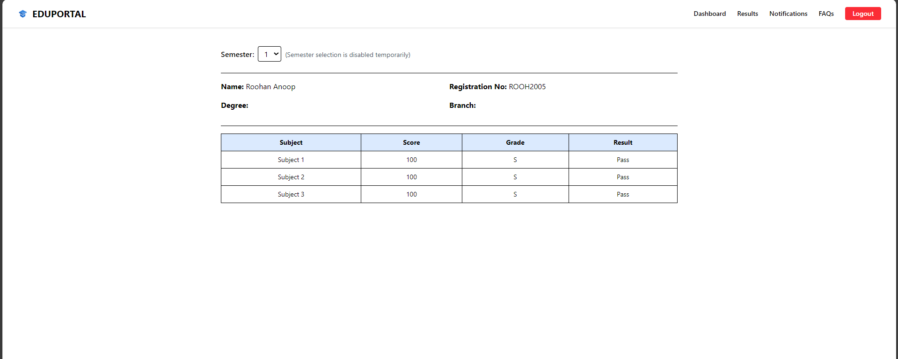
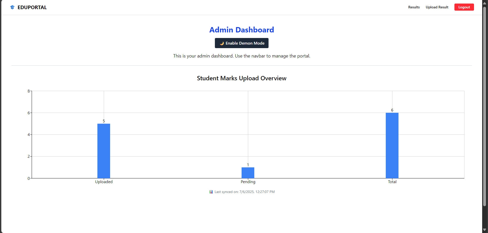
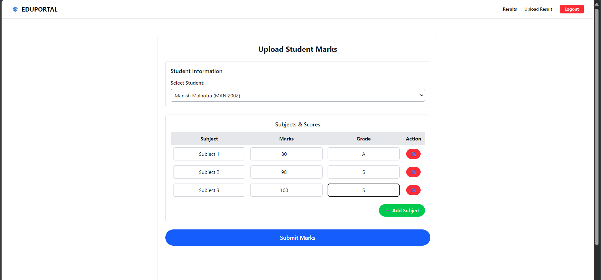
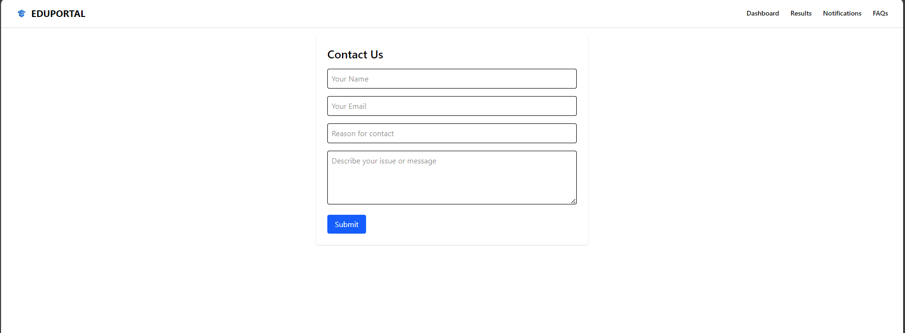

# 🎓 EduPortal

EduPortal is a student result portal where students can log in to view their academic profiles and results, while admins can upload and manage student marks. Built using React, Tailwind CSS, Node.js, Express, and MongoDB.

## ✨ Features

- 👨‍🎓 Student registration & login
- 🧑‍💼 Admin login and dashboard
- 📈 Result upload & management
- 🎯 Profile update feature
- 💬 Feedback form with contact saving
- 📊 Data visualization for admin
- 🧠 Motivational quote API integration

## 📦 Tech Stack

- Frontend: React.js, Tailwind CSS, React Router
- Backend: Node.js, Express.js, MongoDB, Mongoose
- APIs: ZenQuotes API for motivational quotes

---
## Hosting the Project
1. Clone the Repository
- git clone https://github.com/RoHn0710/EduPortal.git
- cd EduPortal

- 📁 File Structure
- EduPortal/
- ├── eduportal-backend/
- └── eduportal-frontend/

2. Install Dependencies

 - Backend (MongoDB server should be running)
  - cd eduportal-backend
  - npm install

 - Frontend
  - cd ../eduportal-frontend
  - npm install

3. Start Servers

- Start Backend Server
 - cd ../eduportal-backend
 - node server.js

- Start Frontend Server
 - cd ../eduportal-frontend
 - npm run dev

- 🚀 Visit in browser
  - http://localhost:5173/

---

## 🧭 Project Walkthrough

🔹 1. Home Page  
Displays a clean welcome page with navigation options for students and admins.  
Includes an overview of EduPortal and a prompt to register or log in.

🔹 2. Authentication  
Separate login pages for students and admins.  
Credentials are securely verified with the backend.

🔹 3. Student Dashboard  
Shows a welcome message and motivational quote fetched from an external API.  
Includes student profile details with an option to edit them.  
Displays results uploaded by the admin.

🔹 4. Admin Dashboard  
Dark/light mode toggle for theme control.  
Admin can view charts showing mark upload status (Uploaded vs Pending vs Total Students).  
Includes navigation to upload or edit student results.

🔹 5. Result Upload  
Admins can select a student from a list, choose a semester, and upload subject-wise marks.  
Supports updating existing marks and visually confirms the process.

🔹 6. Profile Management  
Students can update their basic details like full name, parents' name, DOB, joining year, etc.  
Data is stored and fetched using MongoDB.

🔹 7. Contact Page  
Users can submit queries or feedback.  
Data is stored in the backend and can be reviewed by admins.

🔹 8. Quotes & Motivation  
Each dashboard shows a motivational quote using the ZenQuotes API.  
Users can refresh the quote with one click.

---
## Screenshots

### 🏠 Home Page

### 🔐 Login Page

### 📝 Registeration Page

### 👨🏻‍🎓 Student Dashboard Page

### 📊 Result Page

### 🛠️ Admin Dashboard Page

### 👩🏻‍💻 Marks Uploading Page

### 📧 Contact Us Page

---

Made with ❤️ by Roohan Anoop at Skillmate AI